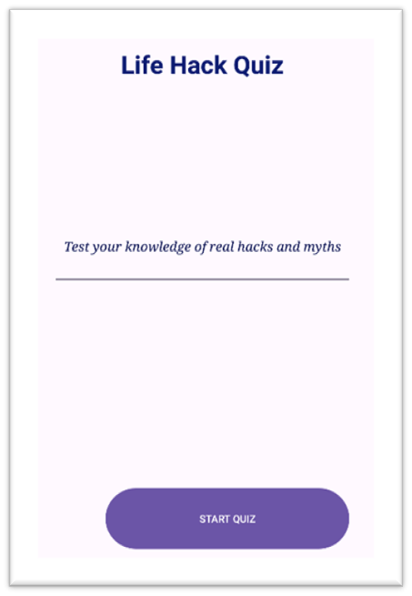
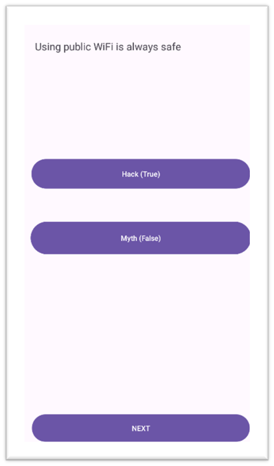
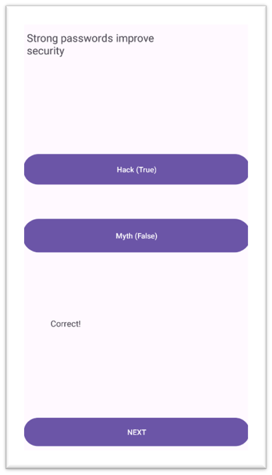
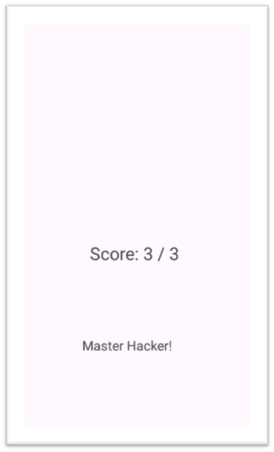

# LifeHackQuizApp

### Theory (Purpose, Design, GitHub, GitHub Actions)
Kotlin Android quiz app for IMAD assignment

## Screenshots

## Links
Word Document: C:\Users\27784\Documents\Life Hack.docx
https://github.com/mossbomobuhle9-alt/LifeHackQuizApp

### Youtube
<html><head><meta http-equiv="Content-Type" content="text/html; charset=UTF-8"/></head><body>IMAD ASSIGNMENT 2  <a href="https://youtube.com/watch?v=Zry1ypCIiPg&amp;si=U0Fg0KoRk4qm-Ry3">https://youtube.com/watch?v=Zry1ypCIiPg&amp;si=U0Fg0KoRk4qm-Ry3</a></body></html>

### GitHub
https://github.com/mossbomobuhle9-alt/LifeHackQuizApp.git

## Reference List
Activities and activity lifecycle. Available at: <a href="https://developer.android.com/guide/components/activities/activity-lifecycle">https://developer.android.com/guide/components/activities/activity-lifecycle</a> (Accessed: 24 April <a href="tel:2026">2026</a>).  Android Developers. (<a href="tel:2024">2024</a>). Build your first app. Available at: <a href="https://developer.android.com/training/basics/firstapp">https://developer.android.com/training/basics/firstapp</a> (Accessed: 24 April <a href="tel:2026">2026</a>).  Android Developers. (<a href="tel:2024">2024</a>). User interface (UI) design basics.